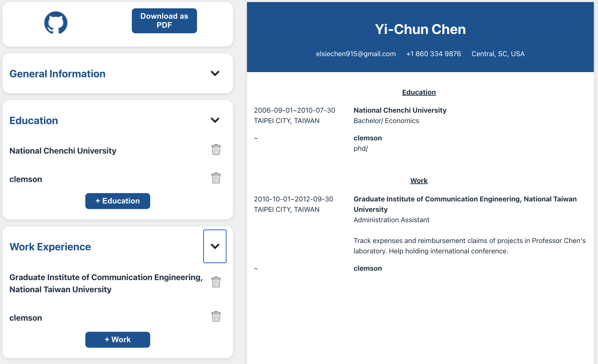

# CV Application

This is a CV Generator application built with React! This user-friendly tool allows you to effortlessly create a basic CV by inputting key information such as personal details, education history, and work experience. 

As you type and update your data, the app generates an instant preview of your CV in real-time. Plus, you can add additional education and work experiences as needed. 

Once you're satisfied with your CV, you can download it as a PDF file.

## Table of Contents

- Demo
- Technologies Used
- Features
- Credits

## Demo

Check out the [**live**](https://lustrous-blancmange-e6afeb.netlify.app) demo.

## Technologies Used

- HTML
- CSS
- JavaScript
- React

## Features

- Use React state to manage dynamic data within a component
- Use React props to pass data from a parent component to a child component and to configure child components
- Use html2canvas library to convert a rendered React component into an image and use jspdf library to convert the image into a PDF
- 
## Credits

- The Odin Project: [CV Application](https://www.theodinproject.com/lessons/node-path-react-new-cv-application)
- Icons: [ICONS8](https://icons8.com/icons)

